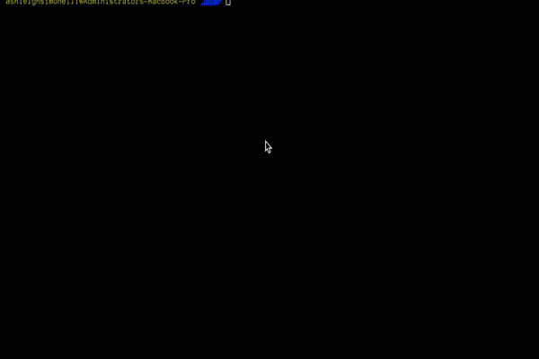

# reapit
Command line interface tool for reapit 



## Commands

command | description | args &amp; options
--- | --- | --- 
`deployment create` | Create a new deployment configuration | 
`deployment list` | List your existing deployment configurations | 
`deployment run {deploymentId}` | Run a deployment configuration | 
`config` | Create, update or show your config | 

## Create commands

Commands are written in an OOP method and are bootstraped with the `AbstractCommand` class which provides some helpful functions for creating commands

```ts
@Command({
  name: "example", // reapit example
  description: "An example command on how to build a reapit cli command", // for the help option
})
export class ExampleCommand extends AbstractCommand {
  run(
    @Param({
      name: 'param', // name for help
      default: 'default value',
    })
    param: string,
  ) {
    console.log(param) // inputted arg or 'default value'
  }
}
```

> All commands must use the `Command` decorator so that the command can be found to be ran


### Parent commands

Parent commands are grouped commands for running as sub commands. Below is an example of a sub command

```bash
$ reapit deployment create
```

where `deployment` is the command group and `create` is the sub command.

Parent commands will extends the `ParentCommand` class

```ts
@Command({
  name: 'deployment',
  description: 'For managing deployments',
})
export class DeploymentCommand extends ParentCommand {
  commands = [new DeploymentCreate(), new DeploymentList(), new DeploymentRun()]
}
```
