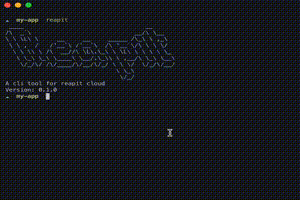
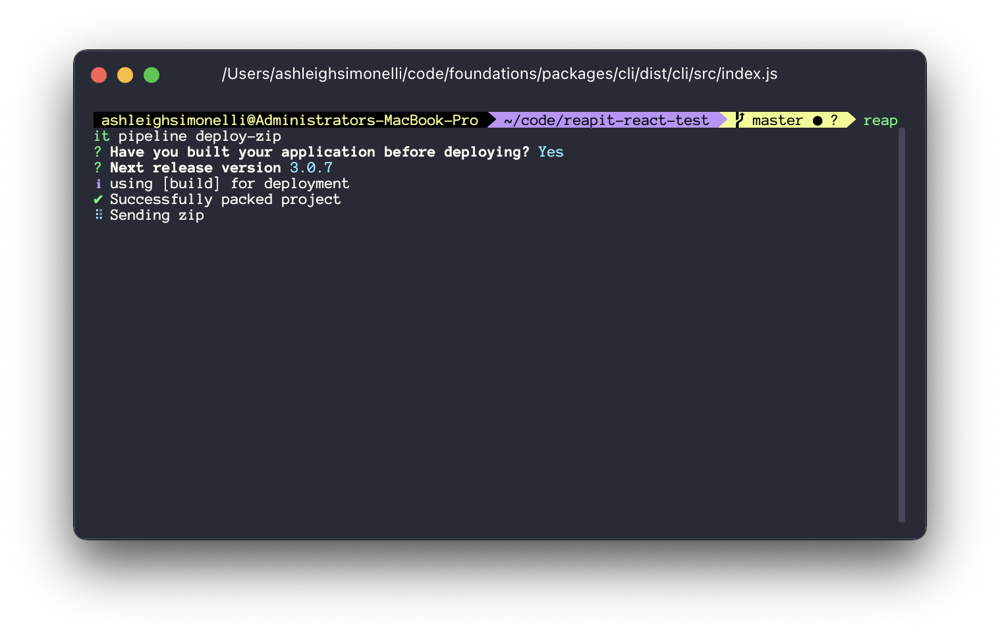

# Reapit-cli
Command line interface tool for reapit 



## Install

Make sure you have an `.npmrc` file in your root and add a valid npm token to the registry url like the example below. Without a global `.npmrc` file with your provided token, you will not be able to download the cli

```
//registry.npmjs.org/:_authToken=NPM_TOKEN
```

> You can obtain a valid npm token from the reapit developers

```bash
$ npm i -g @reapit/cli
```

## Api Key

In order to run commands you'll need to obtain an api-key in order to make authenticated requests.

Get your api-key from the (reapit developers)[]

Add your api-key to your cli


```bash
$ reapit config
```

You'll be prompted with an input for your api-key


## Deployment

> First make sure you've created a pipeline by either the UI or the cli using `reapit pipeline create`.

Start the deployment by running the following command

This will start a manual deployment by uploading a zip of your locally built application.

```bash
$ reapit cli deploy-zip
```

answer the following questions and the deployment will start.



# Development

This section is for the development of the reapit cli

## Creating commands

Commands are written in an OOP method and are bootstraped with the `AbstractCommand` class which provides some helpful functions for creating commands

```ts
@Command({
  name: "example", // reapit example
  description: "An example command on how to build a reapit cli command", // for the help option
})
export class ExampleCommand extends AbstractCommand {
  run(
    @Param({
      name: 'param', // name for help
      default: 'default value',
    })
    param: string,
  ) {
    console.log(param) // inputted arg or 'default value'
  }
}
```

> All commands must use the `Command` decorator so that the command can be found to be ran

### Add new command

When adding a command to the cli, it will need to be added to the runnable commands array in the bootstrap func which lives in the `index.ts` file

```ts
boot(new IntroCommand(), [new ConfigCommand(), new DeploymentCommand(), /* add new command here*/])
```

### Parent commands

Parent commands are grouped commands for running as sub commands. Below is an example of a sub command

```bash
$ reapit pipeline create
```

where `pipeline` is the command group and `create` is the sub command.

Parent commands will extends the `ParentCommand` class

```ts
@Command({
  name: 'pipeline',
  description: 'For managing deployments',
})
export class PipelineCommand extends ParentCommand {
  commands = [new PipelineCreate(), new PipelineList(), new PipelineRun()]
}
```
