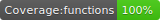
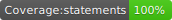

# Cognito Custom Mail Lambda

   

Lambda that intercepts Cognito Emails and applies custom Reapit response.

## HTML generation

In order to generate html from mjml, use command `yarn generate-html`. This'll create/update the html files for the mjml template files.
 
 
 
