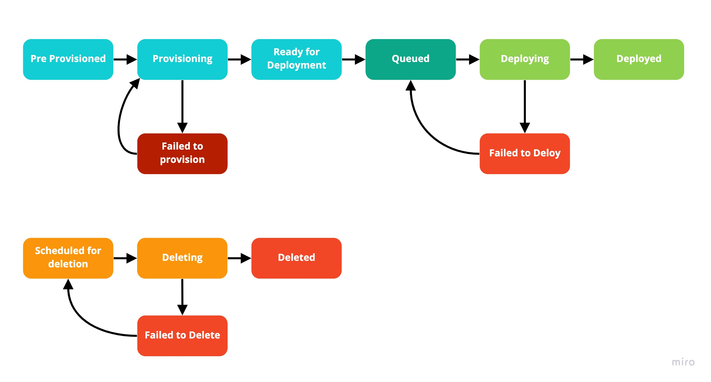
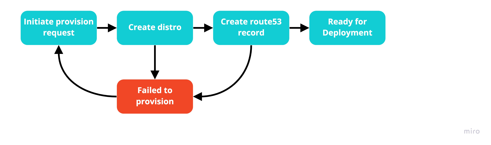
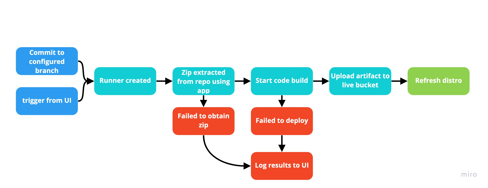
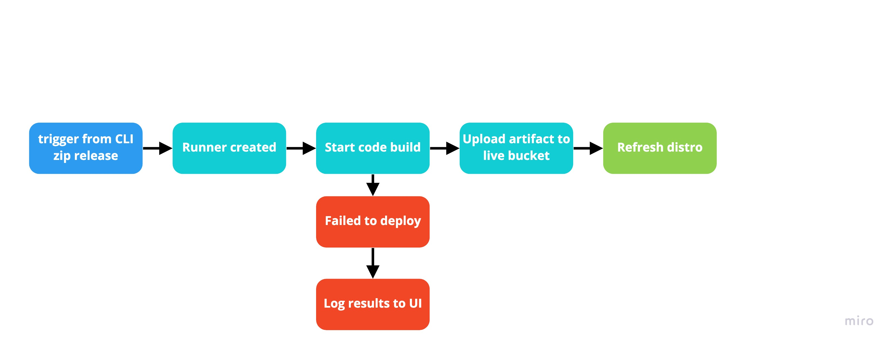
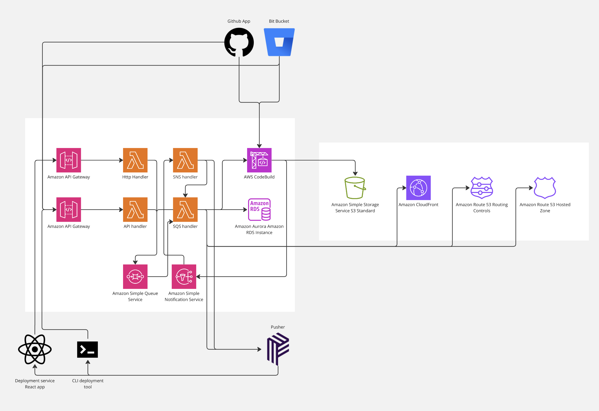
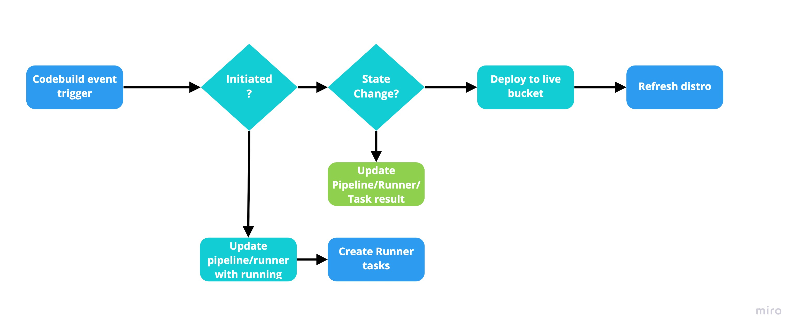

# Deployment Service

> Deployment service for troy (IaaS) project

## TypeORM

### Config

#### Cli

For the typeorm cli, you'll need to make sure you have the `ormconfig.json` file locally first.

> The cli is used for the migration scripts defined below

### Migrations

#### Run

This will run all the migrations and update the database schema.

```bash
$ yarn migration:run
```

#### Generate

The below command will create a new migration for changes made to the entities

```bash
$ yarn migration:generate MyNewMigration
```
> Don't forget to give a useful name for your migration!

## Workflows

### Build status workflow

Below is an example of build statuses and the general flow of one to another. 



Build Status | Description
--- | ---
Pre Provisioned | A pipeline created without r53 or distro
Provision Request | A pipeline that has been queued for provisioning
Provisioning | Currently creating r53 and distro
Ready for Deployment | An undeployed pipeline, provisioned and ready for first deployment
Queued | A pipeline requested for deployment and is in a state of requested but not currently deploying
Deploying | The pipeline is currently in deploying 
Deployed | Successfully deployed to live
Failed to Deploy | Failed to deploy to live
Scheduled for Deletion | The pipeline has been requested for deletion but is not currently being deleted
Failed to Provision | Failed to create r53 or distro for pipeline
Deleting | Currently deleting the pipeline
Failed to Delete | Failed to delete the pipeline
Deleted | Pipeline has been deleted (only in events, pipeline is not soft deleted)

### Provisioning Flow

Below is the flow of how the provisioning is completed with fallbacks and allows for retries.




### Deployments

Below are diagrams of different deployment triggers and their processes.

#### Automated

With automated deployments, the codebase/source is obtained from the repository via the installed Repository App. Codebuild is utilised here to `Download Source`*, `Install`, `Build`, (`Test`), and `Archive` the built resources. After codebuild has successfully installed, built and archieved the resources. The process will deploy to a live S3 bucket and then refresh the distro.



> Test is not yet available

> *`Download Source` is also utilised by codebuild where appropriate.

#### Releases

A Release deployment flow is much simpler to that of the automated flow. Rleases are trigger from the cli and requires a pre-built zip of the resources. Therefore download source and codebuild is mitigated here.



## Architecture
Below is a diagram displaying the 3rd part services, how they communicate with the deployment service, the resources responsible for managing the deployed website and how they operate together.




## Event Handlers

### Codebuild Update Handler

Below is a diagram of the base conditions of the Codebuild Update Handler which is triggered from codebuild update triggers on SNS.



### App Event Handler

The app Events handler is a very simple handler. The function is triggered from the queue provided from the Apps Team. 

The Function handles both `Created` and `Deleted` events and either creates a pre-provisioned pipeline for the app or schedules a pipeline for deletion.

## Important Functions

### Pipeline TearDown & starter

The pipeline teardown functions are as follows 

#### Pipeline Teardown Start

Required to disable the distro and await for the distro to be disable before deletion

#### Pipeline Teardown

Deletes the Distro, r53 record and pipeline info from the database


### Pipeline codebuild executor

Base there are several methods to start the codebuilder; there is a function that is triggered by an SQS queue that each codebuild trigger method publishes to.

## Repository Apps

### Github

#### Authentication

The authentication is handled between the app credentials and the installationId of the repository install. This event, unlike the bitbucket event is sent on the install of the repository.

### Bitbucket

The bitbucket app (plugin) requires 2 lambdas in order to function. The first is a config function that returns the required config on a `GET` call when installing/update the bitbucket app. 

The other is the webhook function required for handling bitbucket events.

#### Authentication

Authentication with bitbucket is done using the installations (the plugin installed on the user's account) credentials sent to the webhook when the first install happens. This is an event that happens when the app is installed on an account. Not a repository!

