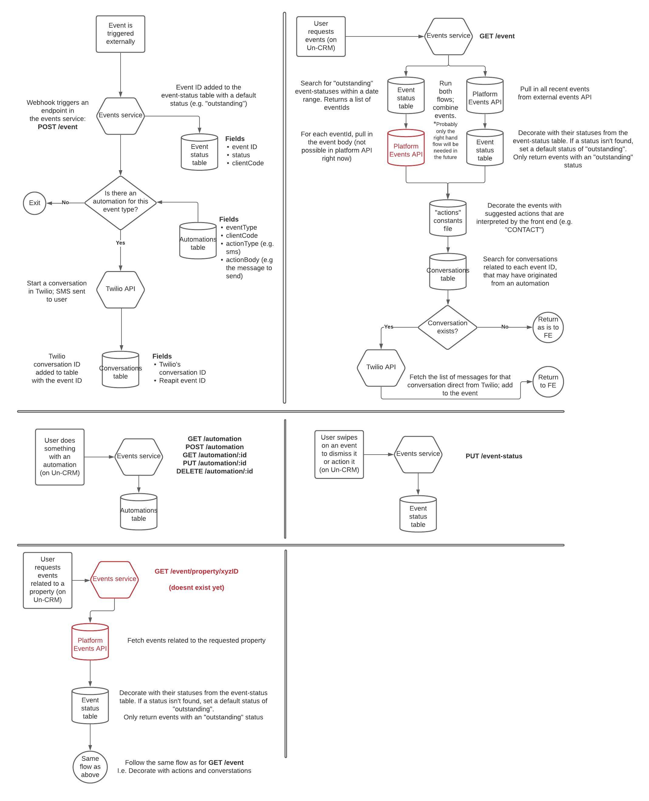
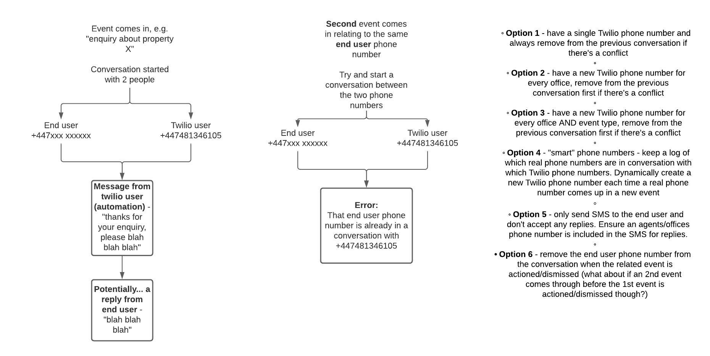

# Events Service

This is a microservice to store and manage event automations and event statuses. It has two other major functions:

1. Provides an endpoint that acts as a webhook for the Events API - this sets up a default event status and can also trigger any automations that might been set up.
1. Provides an endpoint for clients to pull a list of events that are decorated with any automation conversations, and also with suggested actions.



Data is persisted in DynamoDB. All API routes are protected by Reapit Cognito authentication, and must be accessed with a Cognito ID Token in the `Authorization` header

   

# Endpoints

## Events Statuses

#### Create an event status

POST /event-status

- Body

```json
{
  "eventId": "c23b0f02-0bc1-43ee-8b8f-2e88827a551a",
  "clientCode": "SBOX",
  "status": "outstanding",
  "eventCreatedAt": "2021-01-06T19:00:12.357Z"
}
```

- Response 200

```json
{
  "eventId": "c23b0f02-0bc1-43ee-8b8f-2e88827a551a",
  "clientCode": "SBOX",
  "status": "outstanding",
  "eventCreatedAt": "2021-01-06T19:00:12.357Z",
  "statusCreatedAt": "2021-01-06T19:06:00.000Z",
  "statusUpdatedAt": "2021-01-06T19:06:00.000Z"
}
```

#### Get an event status, by the ID of the event

GET /event-status/:eventId

- Response 200

```json
{
  "eventId": "c23b0f02-0bc1-43ee-8b8f-2e88827a551a",
  "clientCode": "SBOX",
  "status": "outstanding",
  "eventCreatedAt": "2021-01-06T19:00:12.357Z",
  "statusCreatedAt": "2021-01-06T19:06:00.000Z",
  "statusUpdatedAt": "2021-01-06T19:06:00.000Z"
}
```

#### Update an event status, by the ID of the event

PUT /event-status/:eventId

- Body

```json
{
  "status": "actioned"
}
```

- Response 200

```json
{
  "eventId": "c23b0f02-0bc1-43ee-8b8f-2e88827a551a",
  "clientCode": "SBOX",
  "status": "actioned",
  "eventCreatedAt": "2021-01-06T19:00:12.357Z",
  "statusCreatedAt": "2021-01-06T19:06:00.000Z",
  "statusUpdatedAt": "2021-01-06T19:06:00.000Z"
}
```

#### List event statuses

GET /event-status

- Query parameters

  - `clientCode`
  - `dateFrom` (searches on the eventCreatedAt field)
  - `dateTo` (searches on the eventCreatedAt field)
  - `status` (optional)

* Response 200

```json
[
  {
    "eventId": "c23b0f02-0bc1-43ee-8b8f-2e88827a551a",
    "clientCode": "SBOX",
    "status": "actioned",
    "eventCreatedAt": "2021-01-06T19:00:12.357Z",
    "statusCreatedAt": "2021-01-06T19:06:00.000Z",
    "statusUpdatedAt": "2021-01-06T19:06:00.000Z"
  },
  {
    "eventId": "c23b0f02-0bc1-43ee-8b8f-2e88827a551b",
    "clientCode": "SBOX",
    "status": "dismissed",
    "eventCreatedAt": "2021-02-06T19:00:12.357Z",
    "statusCreatedAt": "2021-02-06T19:06:00.000Z",
    "statusUpdatedAt": "2021-02-06T19:06:00.000Z"
  }
]
```

## Automations

#### Create an automation

POST /automation

#### Update an automation

PATCH /automation/:id

#### List automations

GET /automation

#### Get a single automation

GET /automation/:id

#### Delete an automation

DELETE /automation/:id

## Events

#### List events

GET /event

- Query parameters

  - `clientCode`
  - `dateFrom`
  - `dateTo`

#### Create event webhook

POST /event

# Future considerations

- There is an open question on what to do about Twilio phone numbers. Currently it's set up with just one Twilio phone number which presents problems when trying to put a client in multiple conversations. See below image for the problem description and some possible solutions.
- 
- May want to amend the front end to allow the edit and delete of automations. Currently just read and create of automations is supported, although we do have the endpoints for edit and delete already in this API
- Twilio requires phone numbers supplied in an exact format or it fails - depending on the format they are stored in the platform, we may need to cleanse/transform numbers before they are used in Twilio
- If an automation message is sent, then the related event is dismissed or closed, and then an SMS message reply is sent by the end user anyway, we should re-open that event so the reply is shown to the agent still. Will need a Twilio web hook to listen for all messages and check their event-statuses, in case the event needs re-opening
- We could add the middlewares (e.g. validate-request/decode-token) to the node-utils library to share the code across packages
- Test automations should come by triggering an actual event in the platform events API, which in turn triggers the webhook, rather than just triggering the webhook. This way it'll be a proper end to end test.
