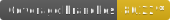

# Web Components

   

Embeddable TypeScript widgets to enhance static sites. For usage visit [here](https://foundations-documentation.reapit.cloud/api/web#search-component).

Under active development pre-alpha.

For detailed documentation [visit here](https://foundations-documentation.reapit.cloud/open-source/packages#web-components).
